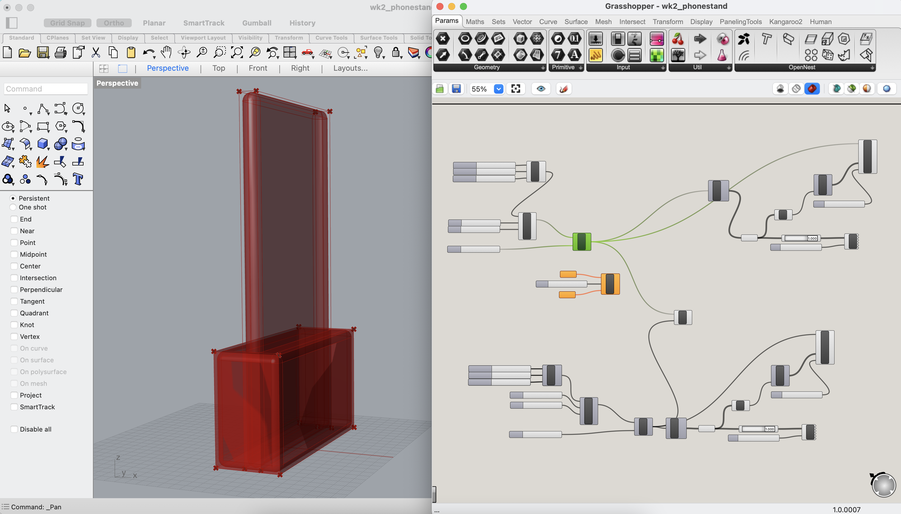
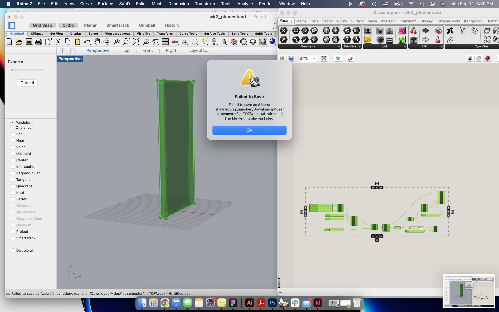
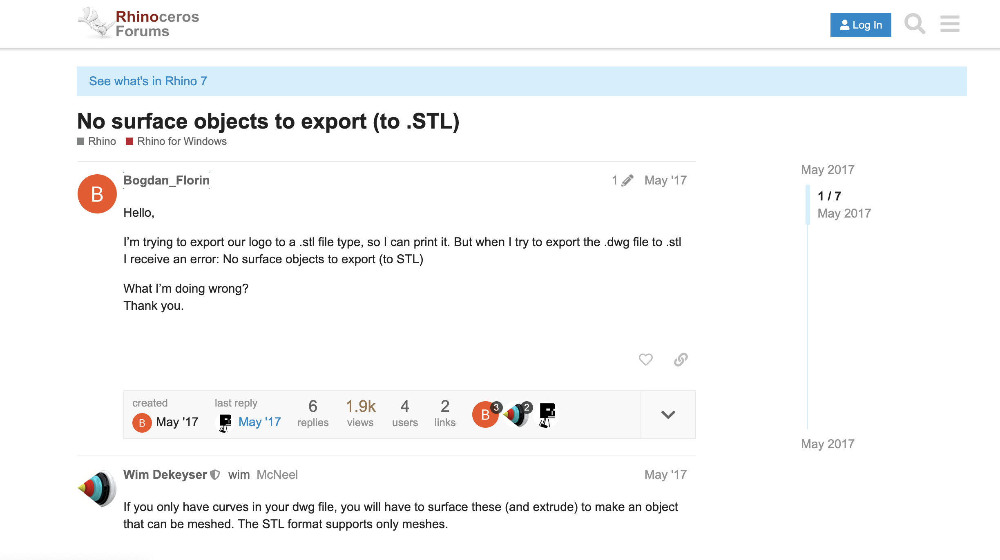
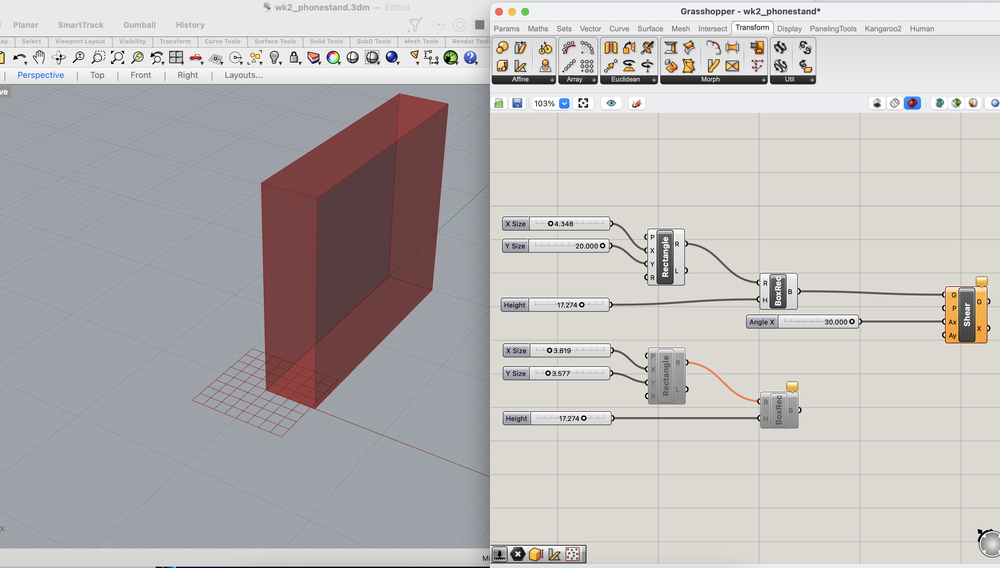

# 👼 Week of 09/12/23 (Week 4)
## Shayne Shen, Technology Design Foundation

### Reflections
🟠 Prepare for a lot of pictures. Make sure you're on wifi 💻！

I started from what I left over last week. 

The taller rectangle is the exact same size as my iPhone, and the lower rectangle is supposed to be a cellphone stand. It feels almost like half of an Airpod case, but it wouldn't be able to carry a smartphone, the mass point and weight of which are both a lot higher than an Airpod. 

### Design Ver.1

### Oops! 
I could not export the Rhino file as STL for 3D printing. 

I Googled it up and got some funny results...

I kept trying for a while then I realized that...BAKE your model! How could a geometric be selected if it's actually a collection of instructions inside Grasshopper? 

### Speculations
🟡 

### Summary
🔵 
