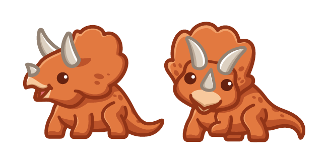

# 😄 Week of 08/28/23 (Week 2)
## Shayne Shen, Technology Design Foundation

### Reflections
🔴 I learned the concept of computational design, an iterative approach to design that utilizes computer algorithms, data, and automation to generate and optimize creative solutions. I also learned about GitHub Markdown, entry-level Rhino, and using Grasshopper to adjust parameters. The demos and examples provided by instructors have been extremely helpful.

🔴 I adjusted the parameters of the cellphone stand in Grasshopper. Although the interface is a bit challenging to get started with, I found the procedural language to be quite similar to many software programs I've used or seen before, such as TouchDesigner and Unity.

🔴 I also completed general safety training and used the laser cutter in the Maker Space to cut a 1/4-inch wood board. I subtly modified the original design, adding more cutouts to reduce the overall weight of the cellphone stand.

🔴 The measurements were a bit off, resulting in the assembly being wobbly. To stabilize it, I used tape at the bottom of the board to keep everything together.

🔴 During laser-cutting, the laser couldn't go through the wood entirely, and there were burning marks and ashes everywhere. I had to manually cut from the back of the board.

### Speculations
> Technology is a word that describes something that doesn’t work yet. — Douglas Adams

🟡 I love this quote because it accurately describes the current state of my MDes life and this project, that the unknown contains infinite possibilities. I will take some time to develop a user scenario for the cellphone stand-up. Maybe it can be a vertical holder for reading recipes while I'm cooking at home. Or it can be both a holder and a sound amplifier. I plan to incorporate 3D printing into the future fabrication process.

🟡 Throughout the process, I can envision several points where AI can assist me. For instance, AI can efficiently retrieve the numerical specifications of our smartphones from a reliable database, saving us time compared to manual measurement or online searches. A well-trained AI, just like Dall-E-2, can generate models that align with our requirements based on our written (or verbal) descriptions. AI's generative nature is a good fit for 3D modeling.

### Summary
🔵 I scratched the surface of computational design which allows me to create designs based on a set of parameters. The biggest challenge is the technical aspect, even though the demo in class effectively shortens the learning curve, I still need some time to adjust to the new variables. 

🔵 Co-teaching can be quite challenging, especially with our large cohort. To Jeff, TJ, and Sudhu, thank you for the time and effort you put into this class! The concept of having three mascots is one of the cutest and cleverest ideas I've come across in a while.

