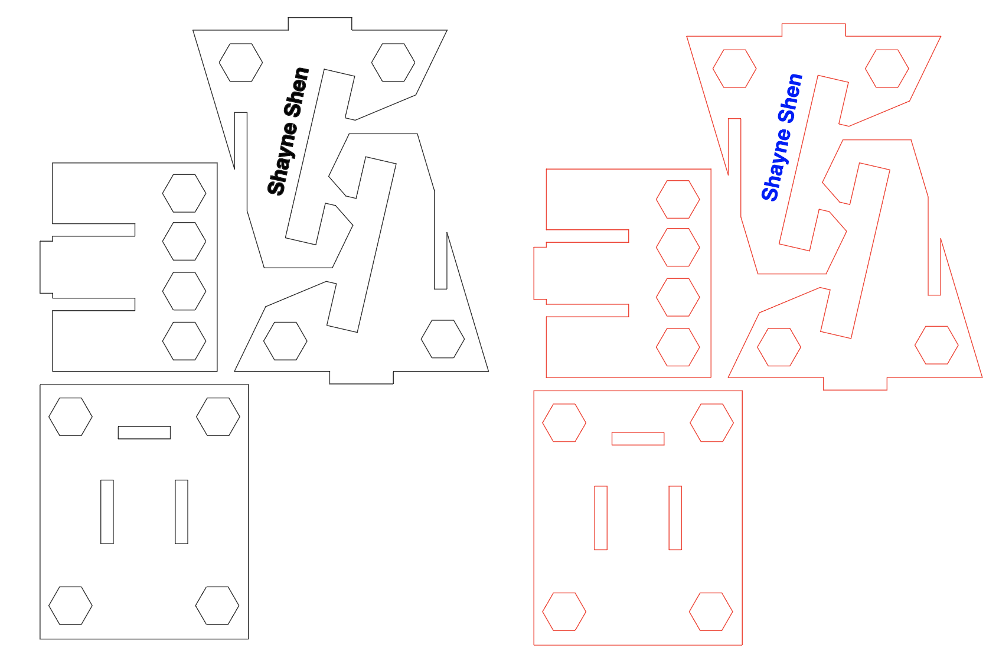
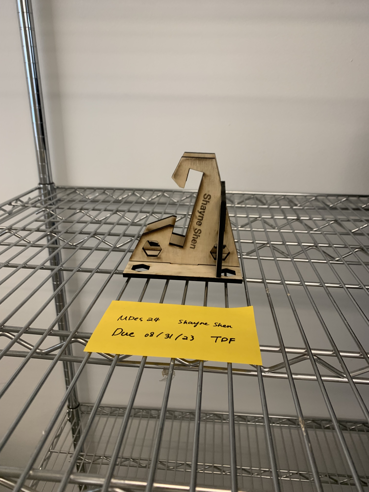

# 😄 Week of 08/28/23 (Week 2)
## Shayne Shen, Technology Design Foundation

## Reflections
🔴 I Learned the concept of computational design, an iterative approach to design that utilizes computer algorithms, data, and automation to generate and optimize creative solutions. I also learned about GitHub markdown, entry-level Rhino, and using Grasshopper to adjust parameters. The demo and example provided by instructors have been utterly helpful. 

🔴 I adjusted the parameter of the cellphone stand in Grasshopper, but I found the interface difficult to navigate💔.

🔴 I also finished general safety training and used the laser cutter in Maker Space to cut a 1/4-inch wood board. I subtly changed the original design, adding more cutouts to reduce the overall weight of the cellphone stand.

## Speculations
> Technology is a word that describes something that doesn’t work yet. — Douglas Adams

I love this quote because it precisely describes the status quo of my MDes life and this project. 
I will come up with a user scenario for the cellphone standup. For now I have two options: one would be a vertical holder for recipe reading while I'm cooking

## Summary:

please include images of attempts to tweak file, & images of laser cut objects (if you are successful)
reflect on the experience of exploring a procedural model whose output is a cell phone stand design in Rhino
Consider: What other contextual observations would be useful to capture?
Consider: What other evaluations of results would be useful to provide as feedback?
Consider: Are there points in the process where you think AI…
Could be used to assist?
Could be trained on input and output?
Other?
