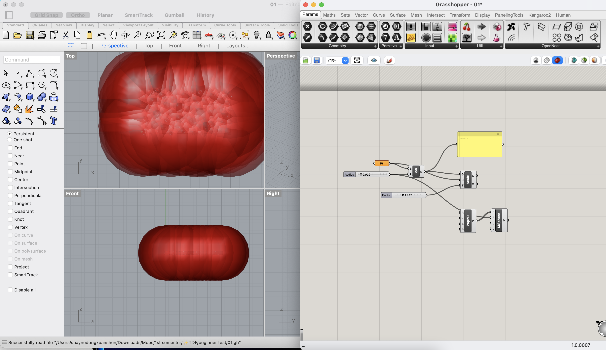
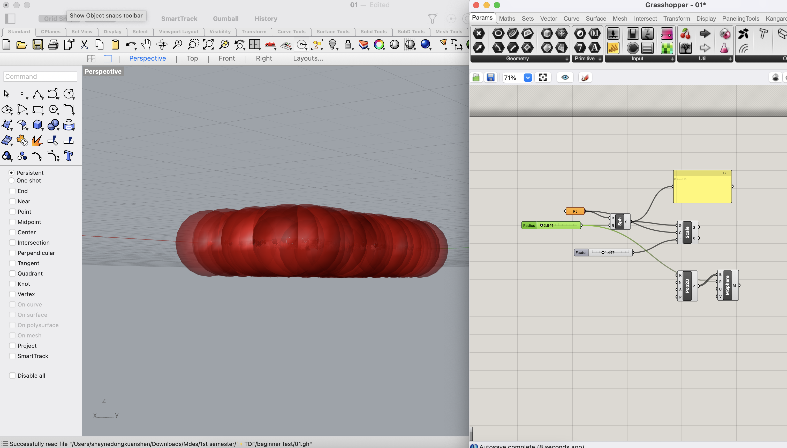
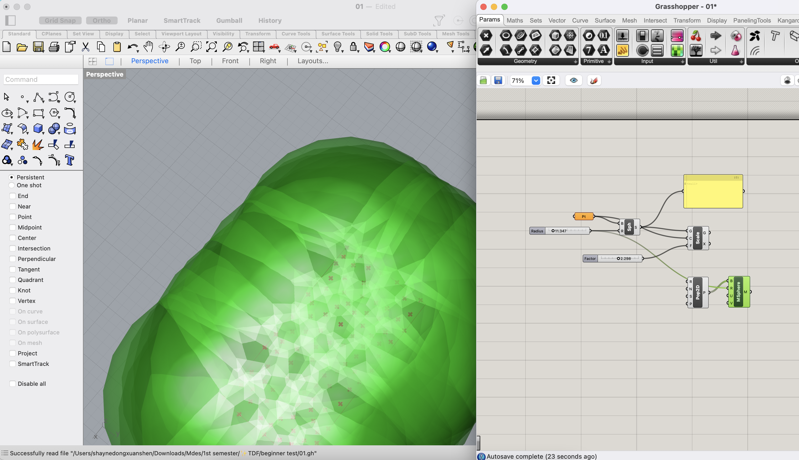
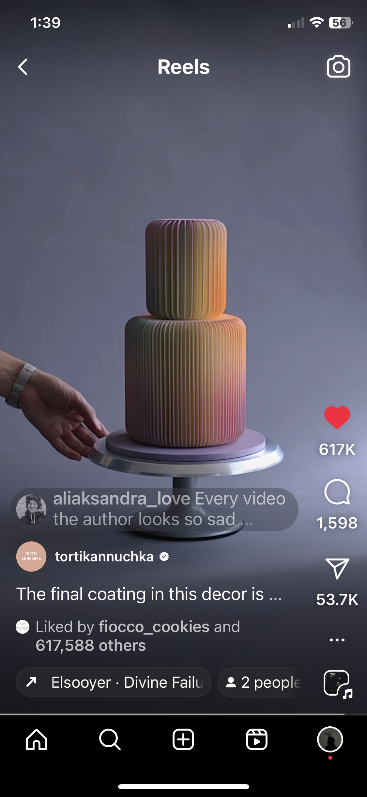

# 🤔 Week of 09/06/23 (Week 3)
## Shayne Shen, Technology Design Foundation

### Reflections
🟠 This week, I delved deeper into parametric design by immersing myself in a few Grasshopper tutorials and putting that knowledge into practice. Building on what I learned last week, I now have a more profound understanding of the software's inner workings.

🟠 It's truly interesting how seamlessly Grasshopper integrates with Rhino, allowing for fast and precise generative modeling. Even starting with a simple geometry, like a sphere as shown below👇, can lead to the creation of fascinating iterative visuals. As a graphic designer, I wonder if Grasshopper can be applied to other scenarios. 

### Speculations
🟡 After my experimentation with Grasshopper, I circled back to our cellphone stand project. My aim is to design a stand that securely holds my phone in a vertical position, at an angle that ensures a clear and comfortable view of the screen. I began with a fundamental yet essential form - rectangles (or cuboids? I don't know why Rhino keeps calling it a 2-point rectangle.).

🟡 I envision this rectangle being inclined towards the ground, with horizontal feet attached to its lower end. However, I'm still trying to figure out the rest of it...

🟡 Although not directly related to this course, I came across an intriguing TikTok account that is worth sharing. This account features videos of a chef crafting cakes with the precision and creativity of an architect working on their final project models. The chef himself often uses a cutting mat, Xeto knife, etc. The cakes he designed are pre-modeled and look like architecture as well. 

🟡 What I notice is that, many famous pastry chefs, like Amaury Guichon known as "the chocolate guy," apply engineering techniques and knowledge to their field and create impeccable work. 

### Summary
🔵
🔵
