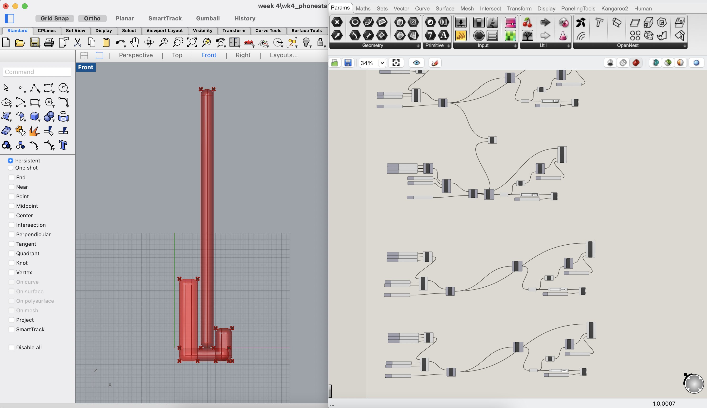
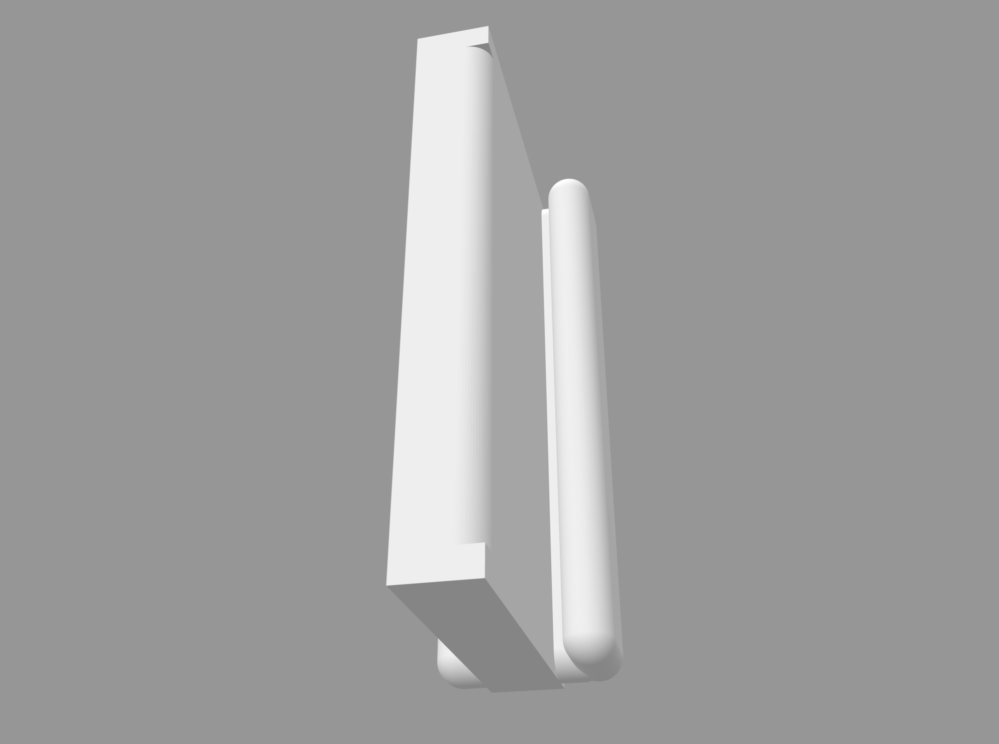
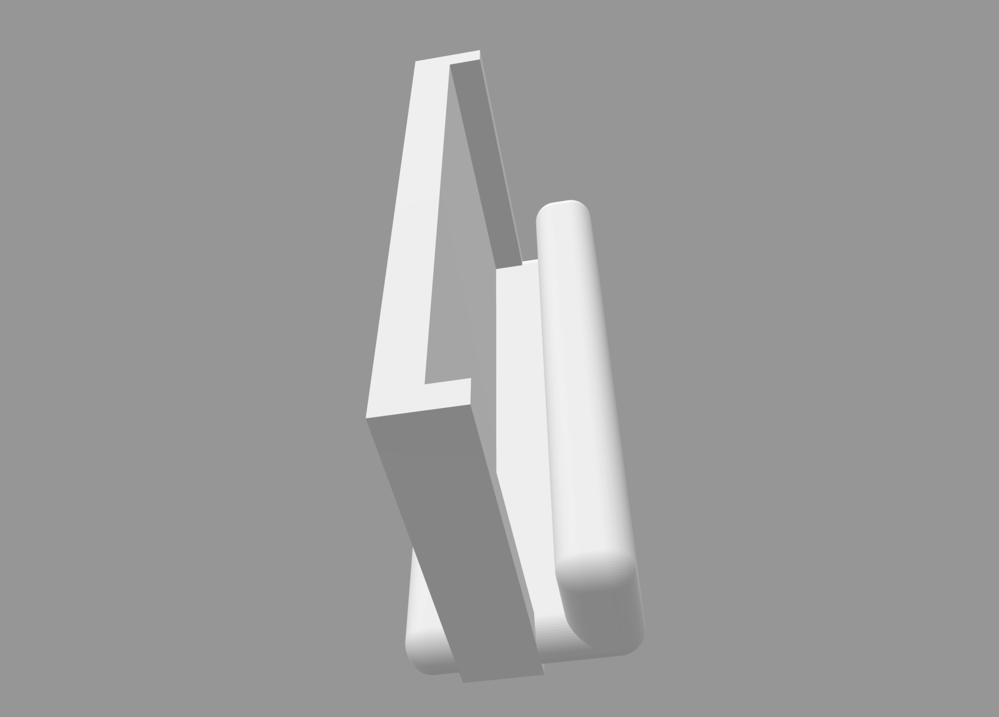
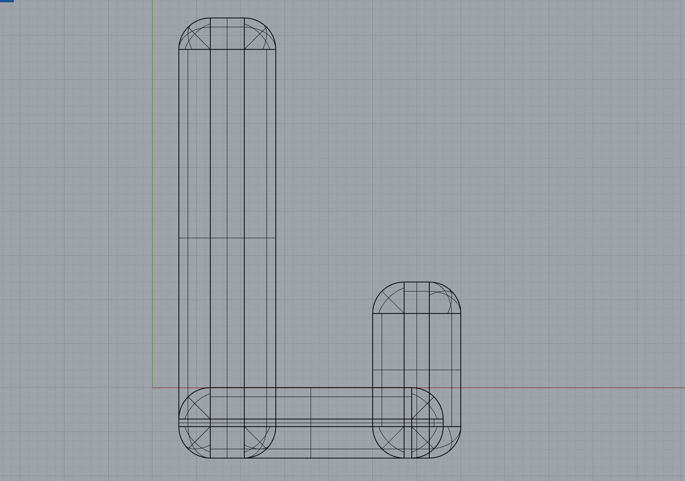
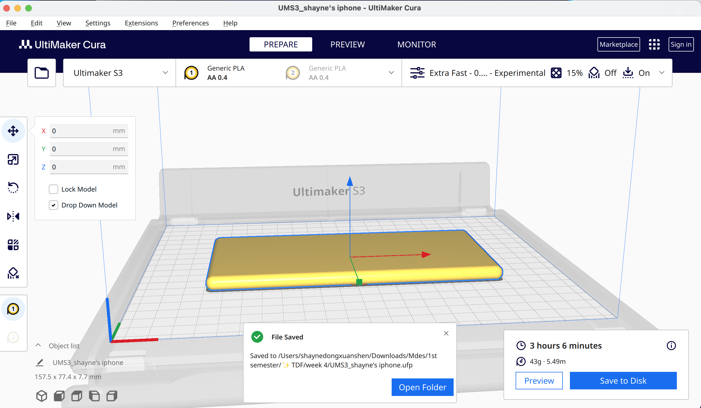
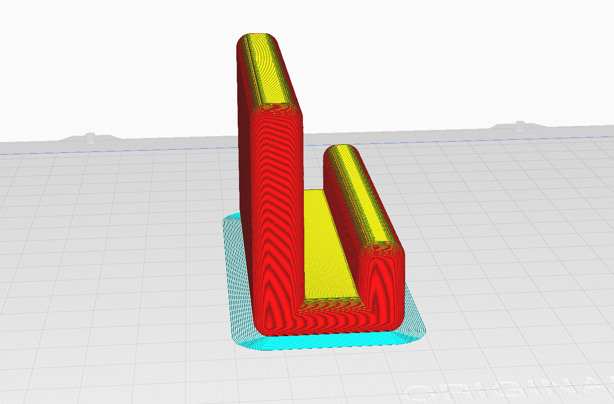
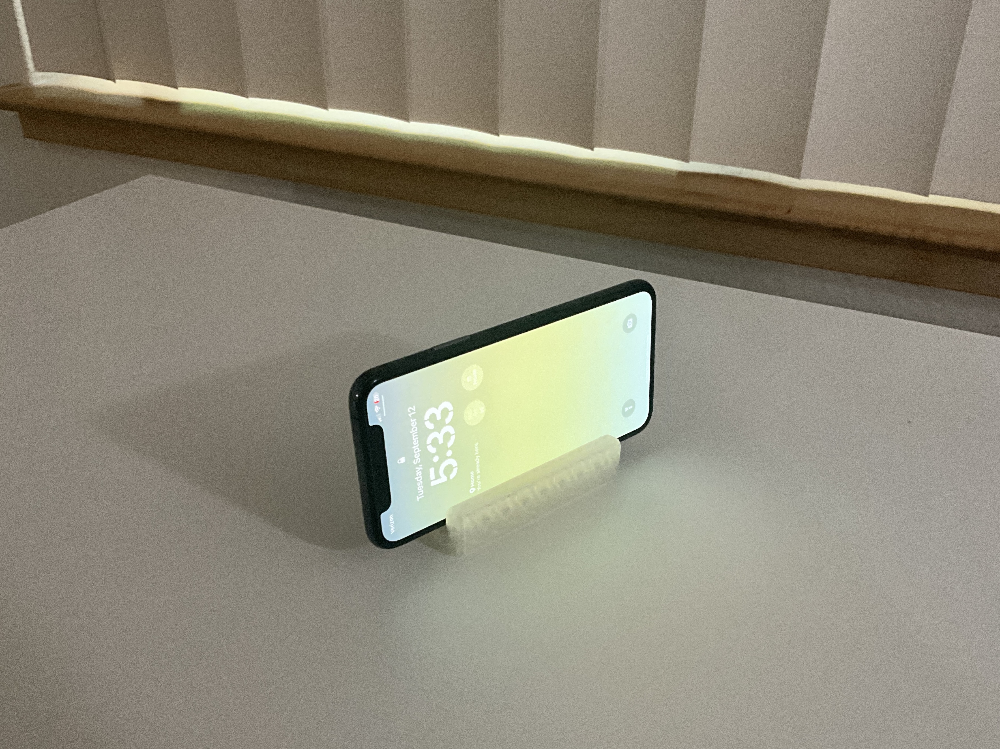

# 👼 Week of 09/12/23 (Week 4)
## Shayne Shen, Technology Design Foundation

### Reflections
🟠 Prepare for a lot of pictures. Make sure you're on wifi 💻！

I started from what I left over last week. 

The taller rectangle is precisely the same size as my iPhone, while the lower rectangle serves as a cellphone stand. It resembles almost half of an AirPod case, but it lacks the capacity to support a smartphone. A smartphone has significantly higher mass and weight in comparison to an AirPod.

### Design Ver.1

### Design Ver.2

### Oops! 
I could not export the Rhino file as STL for 3D printing. 

I kept trying for a while until I had a realization: BAKE your model! How can one select a geometric shape when, in fact, it's a set of instructions within Grasshopper?

## 🖨️ Model Evolution

### V1

### V2

### V3

### V4

### Final Model

Here we got the right amount of roundness! 

## Problem occurred during 3D Printing

### 🖨️ Ultimaker Cura

I started with using Ultimaker S3 on the second floor. It failed the first time...and the second time. 

### 🖨️ Prusa

I failed the first time, but I made it the second time!

It was my first experience with 3D printing, and it took some time for me to properly configure everything and prepare the model for slicing.

Tada!!! I‘m excited about the final result. I'll post all the process into the Monday-due PDF.

### Speculations
🟡 Cody's talk was truly inspiring. His architecture-focused examples provided a unique perspective on computational design. Architects such as Marc Fornes seamlessly integrate advanced digital fabrication techniques into their design processes. 
🟡 The multi-disciplinary application of computational design brings to mind its frequent appearance in visual design, which, interestingly, has relevance to our upcoming project, OpenProcessing. I gained some experience working on it during my college years, and I look forward to experimenting with it.

### Summary
🔵 Our first project ends this week. I took a significant step in challenging myself and exploring new techniques that I had never attempted before.
