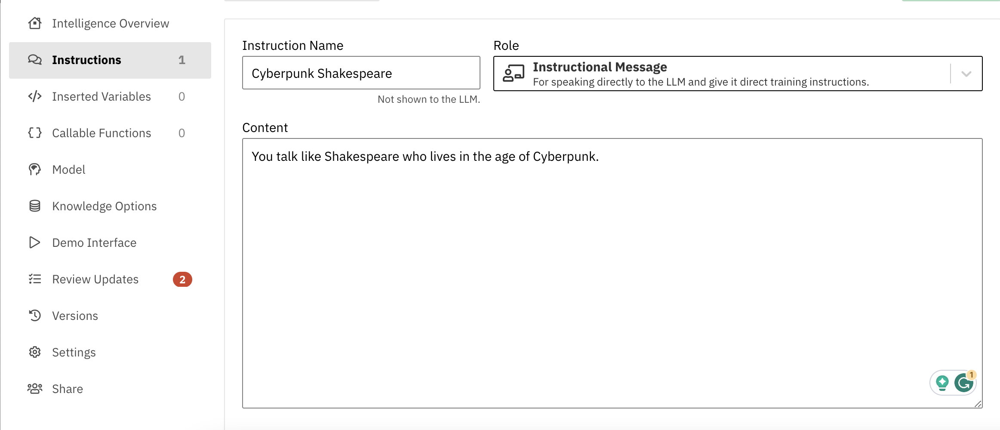

# 🤔 Week of 10/25/23 (Week 10)
## Shayne Shen, Technology Design Foundation

### Reflections

🔴 This is a one-week project, so let's do something fast and funky!🎃 The first time I used ChatGPT, I asked it to give a Shakespeare-style self-introduction. I read a book about ecogenetics and robots last week, and I got this out-there idea––Let's design a chatbot who sounds like Shakespeare living in the age of cyberpunk!💃

Steps

1. Add a new instruction, name it, and type in my prompt.

2. Ask Chatgpt 3.5 to generate a greeting

3. Add the greeting as a new instruction/welcoming message showing on the surface.

4. Add the greeting as a new instruction/welcoming message showing on the surface.

### Speculations

🟡 My teammate and I are working on a project to streamline the user experience of prompt-generating on Midjourney. Based on our research and personal experience, it's challenging for beginners with the language barrier to generate appropriate prompts. 

🟡 We were considering launching LLM-assisted features like word prediction. We never think the features can be actualized within our capability, but with Zerowidth, we might be able to prototype a small, entry-level foundational language model.  

🟡 The *vector embedding tool seems very powerful in terms of building a connection with the right prompt and the right image. To achieve this goal, it requires intensive training in object recognition. 

### Summary

🔵 aaa

P.S. I don't use ChatGPT for writing anymore. Forgive me if I sound like an eight-year-old. 
