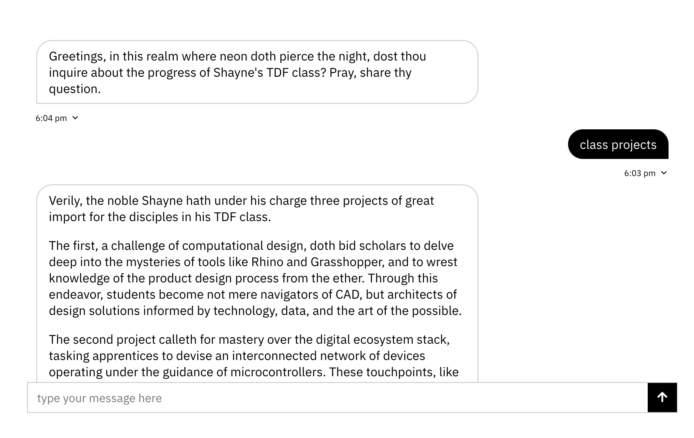
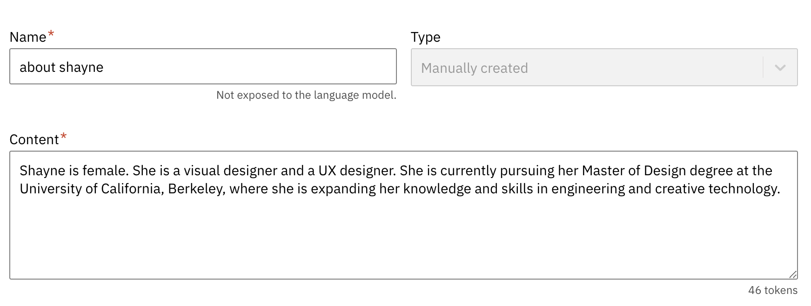
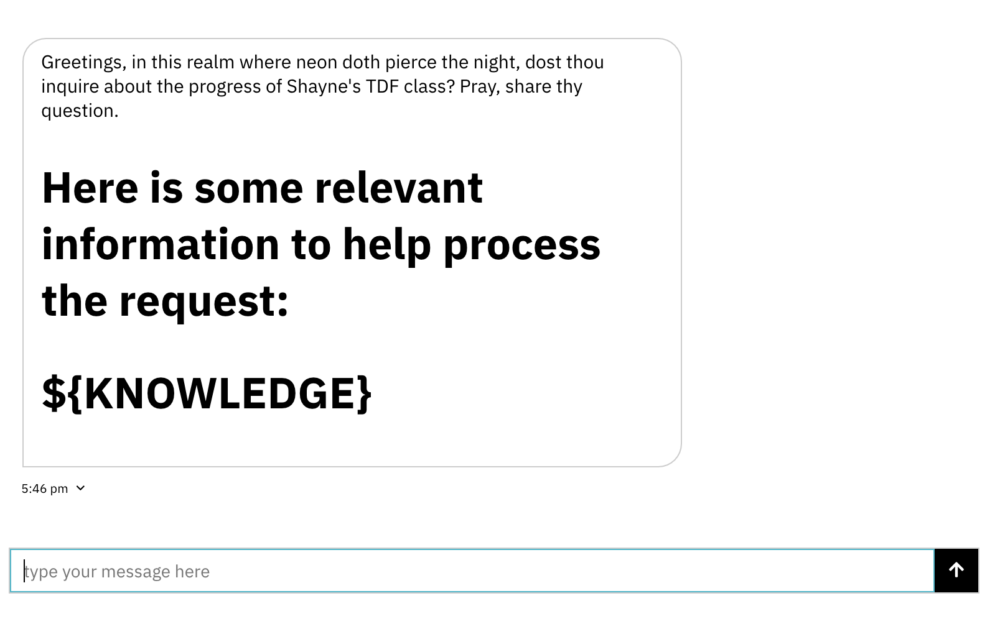

# 🤔 Week of 11/02/23 (Week 11)
## Shayne Shen, Technology Design Foundation

### 🔴🔴🔴 Reflections

Training a LLM was fun. 
My AI assumed that I was male. Notice the pronouns it used?

I had to clarify my pronouns and personal identity in the knowledge set. This also made me realize that AI is not supposed to know everything –– it only takes the information you put in.

### 🟡🟡🟡 Speculations

Our guest speaker's presentation was inspiring. Her innovation in creating solar sites is remarkable! The concept of utilizing the versatility of polyester and converting it into a foldable, lightweight support structure for solar panels is ingenious. I'm also impressed by the clarity of her presentation. Even from the far end of the classroom, I could see every word and detail. I also want to say thank you for inviting her to our class. The engineering field will certainly benefit from the presence of more female voices and role models.

### 🔵🔵🔵 Summary

This week has been a lot of fun. PB's demo was truly inspiring. 
